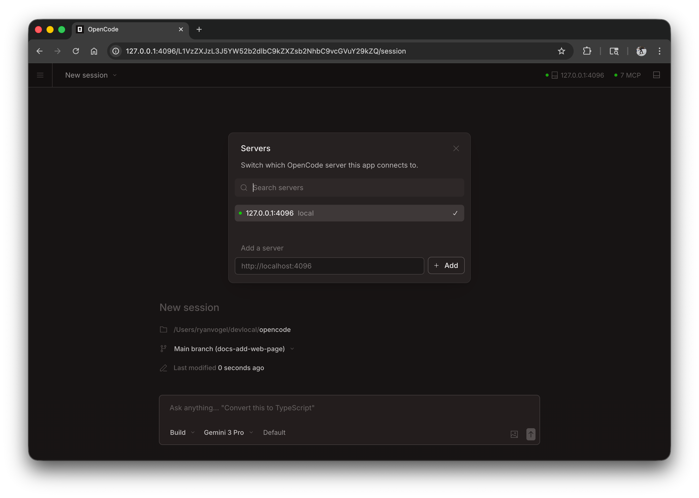

Miao can run as a web application in your browser, providing the same powerful AI coding experience without needing a terminal.


## Getting Started

Start the web interface by running:

```bash
miao web
```

This starts a local server on `127.0.0.1` with a random available port and automatically opens MIAO in your default browser.

:::caution
If `MIAO_SERVER_PASSWORD` is not set, the server will be unsecured. This is fine for local use but should be set for network access.
:::

:::tip[Windows Users]
For the best experience, run `miao web` from [WSL](/docs/windows-wsl) rather than PowerShell. This ensures proper file system access and terminal integration.
:::

---

## Configuration

You can configure the web server using command line flags or in your [config file](/docs/config).

### Port

By default, MIAO picks an available port. You can specify a port:

```bash
miao web --port 4096
```

### Hostname

By default, the server binds to `127.0.0.1` (localhost only). To make MIAO accessible on your network:

```bash
miao web --hostname 0.0.0.0
```

When using `0.0.0.0`, MIAO will display both local and network addresses:

```
  Local access:       http://localhost:4096
  Network access:     http://192.168.1.100:4096
```

### mDNS Discovery

Enable mDNS to make your server discoverable on the local network:

```bash
miao web --mdns
```

This automatically sets the hostname to `0.0.0.0` and advertises the server as `miao.local`.

You can customize the mDNS domain name to run multiple instances on the same network:

```bash
miao web --mdns --mdns-domain myproject.local
```

### CORS

To allow additional domains for CORS (useful for custom frontends):

```bash
miao web --cors https://example.com
```

### Authentication

To protect access, set a password using the `MIAO_SERVER_PASSWORD` environment variable:

```bash
MIAO_SERVER_PASSWORD=secret miao web
```

The username defaults to `miao` but can be changed with `MIAO_SERVER_USERNAME`.

---

## Using the Web Interface

Once started, the web interface provides access to your MIAO sessions.

### Sessions

View and manage your sessions from the homepage. You can see active sessions and start new ones.


### Server Status

Click "See Servers" to view connected servers and their status.



---

## Attaching a Terminal

You can attach a terminal TUI to a running web server:

```bash
# Start the web server
miao web --port 4096

# In another terminal, attach the TUI
miao attach http://localhost:4096
```

This allows you to use both the web interface and terminal simultaneously, sharing the same sessions and state.

---

## Config File

You can also configure server settings in your `miao.json` config file:

```json
{
  "server": {
    "port": 4096,
    "hostname": "0.0.0.0",
    "mdns": true,
    "cors": ["https://example.com"]
  }
}
```

Command line flags take precedence over config file settings.
