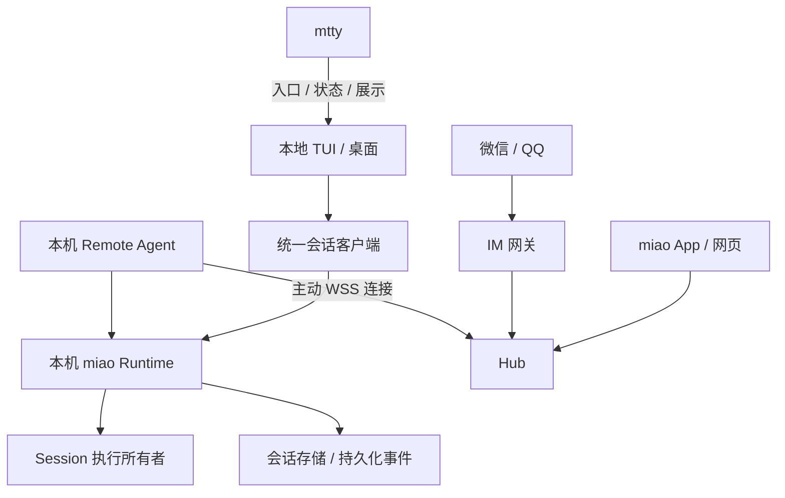

# miao Remote Control：统一会话接入技术方案

状态：拟议，2026-10-04。本文是架构与实施计划，不是已交付功能声明。

承接 [现有 IM 遥控方案](remote-im.md)，统一本机会话执行、客户端协议与远程接入。
目标是让本地 TUI、miao App、网页和微信/QQ 操作同一个本机会话；执行、文件与模型凭证留在会话所属机器。

## 1. 产品目标与边界

- 在当前 Session 输入 `/remote-control`，选择微信、QQ 或 Web/App，通过界面完成启动、登录、扫码或配对。
- 本地与远端可交替发送 prompt、steer/queue、审批、问答和中断，并同步消息、工具活动与文件改动。
- 一个 Hub 可以接入家用电脑、笔记本和开发服务器；执行机器主动向 Hub 建立连接，不要求固定公网 IP 或入站端口。
- 提供本次运行期间的分享和持续接入；后者由系统服务管理器托管执行进程。
- 保留 `/remote` 作为兼容别名，保留 `miao remote` CLI 供脚本与故障诊断使用。

首版限定个人账号、多台执行主机、多个已配对客户端。团队权限、跨机器搬迁活动 Session、任意终端接管、
公网匿名写入、自动放行工具权限不在首版范围。mtty 的 PTY 存活与 miao 的 Session 执行存活分别管理。

## 2. 当前实现与缺口

| 当前能力 | 代码入口 | 本方案中的用途 |
|---|---|---|
| 微信/QQ Connector、Channel、Host | `packages/remote/src/{connector,channel,host}.ts` | 保留平台登录、身份检查、消息限制和账号状态 |
| IM Router、审批码、待取结果 | `packages/remote/src/router.ts` | 增加主机范围，抽出统一会话访问接口 |
| TUI 登录步骤与后台启动 | `packages/tui/src/component/dialog-remote.tsx` | 演进为以当前会话接入为中心的向导 |
| 本机 remote 服务组合 | `packages/miao/src/cli/cmd/remote.ts` | 兼容入口，逐步复用统一 Runtime |
| 持久化 Session 历史及事件订阅 | `packages/protocol/src/groups/session.ts` | 使用 `history` 和 `events?after=` 做恢复 |
| 进程内执行协调 | `packages/core/src/session/run-coordinator.ts` | 保留单进程内排序，补齐执行归属约束 |

当前 `/remote` 可以登录并启动后台，但普通 TUI 的执行进程可能不同；“在守护进程里打开当前会话”仍显示手动
attach 命令。账号已连接不代表当前 Session 可驱动。现有全局 `/api/event` 是实时通知流，不能替代持久化历史；
Session 事件接口已声明按 aggregate sequence 重放再订阅，需验证其在远程重连场景中的竞态与一致性。

这两个缺口分别通过统一执行归属与使用可恢复的 Session 事件接口解决。多个客户端共享同一个执行所有者，
全局通知流与持久化会话流分别承担实时提示与断线恢复。

## 3. 架构与职责



| 组件 | 职责与权威状态 |
|---|---|
| Runtime | 会话执行、输入接纳、工具审批、事件与数据；可复用现有 Core/Server，不重写内核 |
| Remote Agent | 本机身份、远程连接、授权校验、操作分派、订阅与背压；可与 Runtime 同进程组合 |
| Hub | 用户、设备目录、路由、连接状态与转发；不执行工具，不持有模型凭证 |
| IM 网关 | 平台凭证、主人绑定、命令解析、摘要与通知；作为被授权的客户端连接 Agent |
| 统一会话客户端 | 提供一致的会话操作；本地直连与 Hub 传输可替换 |
| App/网页 | UI、设备凭证、有限缓存、事件游标；不持有会话执行权 |
| mtty | pane/PTY、终端渲染、启动入口和状态展示；不成为 miao Session 的第二个执行内核 |

这些是逻辑边界，不要求各自成为一个进程。首版可在一个本机服务中组合 Runtime 和 Agent，在中继主机上
分别运行 Hub 和 IM 网关。网络入口（Cloudflare、反向代理）独立于会话协议。

## 4. 执行归属与生命周期

每个活动 Session 只有一个执行所有者；客户端断开、分享撤销、Hub 重启都不转移执行权。
Session 地址包含 `hostId + sessionId`；主机和客户端 ID 是稳定随机身份，不从 IP、主机名或 PID 推导。

### 4.1 持续模式优先实施

常驻 Runtime 执行 Session，本地 TUI/桌面也连接该 Runtime。关闭 pane 或 UI 不终止任务，显式结束会话或停止
服务才改变执行生命周期。macOS 复用 launchd；Linux/Windows 分别补系统服务管理器适配。

本机启动须有用户范围的单实例锁和经过身份验证的服务发现。不同版本不得误连或争抢同一个数据库中的活动会话。
同一存储下多个执行服务的协作须有排他归属与 fencing；不能把当前进程内 coordinator 当成跨进程锁。
首版禁止并发接管：发现旧执行所有者仍存活时拒绝启动接管，并通过 UI 指向已有服务。

服务崩溃后可以恢复持久化历史和已接纳输入，但不承诺外部工具副作用恰好一次；未完成工具执行应恢复为明确的
待核对状态，遵循内核恢复策略，不能因远程重连盲目重跑。

### 4.2 分享已有独立会话

后续让当前执行进程注册 Agent，只分享它拥有的 Session，生命周期与该进程一致。
普通 TUI 请求持续模式时，不能静默搬迁正在执行的会话。先到安全边界、释放旧所有权、由常驻 Runtime 接管，
再切换客户端；失败则保持原所有者或明确暂停。交接未实现前，UI 必须说明限制，不能显示“持续接入成功”。

## 5. 统一协议与传输

保留依赖方向：Schema 定义数据，Protocol 定义公开契约，Core 实现执行，Server 暴露协议；Client 不依赖
Core/Server，miao 宿主负责组合。不要复制各客户端的审批与输入逻辑，也不要让 Hub 代理任意本机 HTTP URL。

新增 Hub 传输适配层，复用现有会话请求/响应 schema；数据面仅允许显式注册的操作。控制面负责配对、连接、
授权和能力协商。Web 的连接管理不应混进 IM Connector；它们共享会话访问与授权层。

建议的传输信封（字段及版本需要实现前定稿）：

```text
protocolVersion, connectionId, requestId, hostId,
sessionId?, operation, subscriptionId?, payload
```

请求 ID 标识一次业务操作，在重连重试时保持不变；连接 ID 每次更新。支持取消、超时、响应关联和订阅关闭。
本机只在请求已持久化接纳后返回 `accepted`，Hub 收到或网络发送完成只能记为 `sent`。

能力协商至少包含协议版本、会话事件版本、prompt/steer/queue、审批、问答、中断、附件支持及消息大小限制。
能力缺失、权限不足、主机离线和协议不兼容分别返回可诊断错误。

## 6. 身份、授权与加密

### 6.1 三类授权对象

- 用户：Hub 登录身份；各 IM 平台用户经一次性流程绑定到它。
- 设备：主机与客户端公钥及稳定 ID；首次配对须在已授权端确认，有期限、尝试限制和撤销能力。
- Grant：访问主体、主机、项目、Session 范围、操作集合、有效期和撤销状态。

Grant 与 Session 生命周期独立。长期设备授权与临时分享分别管理。权限至少区分 read、prompt、permission.reply、
question.reply、interrupt、session.create 和 device.admin；只读客户端在 Agent 端禁止写入。
新建会话仅允许授权项目，禁止远端提供任意目录或跳过本机工具审批。

授权最终由 Agent 执行，不因 Hub 转发成功就被接受。授权绑定主体公钥；修改、扩权与撤销需要可验证的授权来源。
主机保留授权版本并拒绝旧版本重放；密钥与撤销记录持久化。Hub 负责同步与路由，不能单独签发本机操作权。

### 6.2 两条信任路径

| 路径 | 内容可见方 | 设计 |
|---|---|---|
| App/网页 ↔ Agent | 两端；Hub/Cloudflare 只转发密文 | E2EE、身份绑定、每连接密钥、完整性与防重放 |
| 微信/QQ ↔ IM 网关 ↔ Agent | IM 平台、网关、本机 | 网关作为独立授权客户端，限制范围；不宣称整条路径 E2EE |

浏览器代码来源仍是信任边界；E2EE 不保护恶意网页脚本。静态前端资源需要受控发布、依赖与资源完整性管理。
加密协议采用成熟方案和实现，单独评审，并验证身份绑定、握手、防重放和密钥生命周期。

分享链接不包含本机 Server 密码。短期秘密放 URL fragment，不写日志；配对完成换设备凭证。查询授权时脱敏。
原有 IM 凭证继续采用受保护存储与原子写，不纳入 provider 凭证列表。审计记录主体、范围、操作 ID 和结果，默认不记正文。

## 7. 多端同步、重连与背压

1. 读取会话快照及对应的持久化事件序列水位，再从该水位订阅；若无法原子取得快照与水位，采用已验证的
   subscribe/buffer/snapshot 协议，禁止简单的“先取历史再订阅”留下事件空洞。
2. 使用 `session.events?after=<seq>` 重放并订阅，按 Session 序列去重与排序；游标只在状态应用成功后推进。
3. 持久化事件与临时 token/progress 分开：前者负责恢复事实，后者可合并或丢弃，并在重连后由事实重建。
4. 审批、问答等等待状态恢复时另查当前 pending 集合，不能只依赖全局实时流恰好收到通知。
5. 输入接纳复用现有稳定 message ID 重试语义；审批、问答和中断单独定义幂等/已处理结果，不能假设所有端点已具备。
6. 各客户端有独立、有界的队列和字节预算；网络发送不阻塞 runner。超过上限关闭订阅或请求重同步，不无限缓存。
7. 重连使用心跳和带随机抖动的指数退避；版本或凭证错误停止无效重试并显示可恢复原因。

同一会话本地与远端输入由 Runtime 排序；审批第一次有效提交生效，其余客户端刷新为已处理。写权限允许多端输入，
不意味着多个 runner。附件后续增加上传限额、项目范围校验和流量预算，不经过全局剪贴板路径传输。

首版 Hub 不持久化 prompt 或会话正文。离线时客户端保存草稿，重连后经用户策略与相同操作 ID 提交。
IM 入站去重与操作 ID 必须在交付确认前持久化，以覆盖进程重启后的重复投递；平台已接收不等于用户已看到回复。

## 8. `/remote-control` 与 mtty 集成

界面先选择微信、QQ、Web/App，再选择范围（当前 Session、当前项目、已授权项目）和持续方式。
选择接入后自动检查服务、登录/配对、建立授权、绑定当前 Session，再验证可操作性；正常流程不要求补输命令。
平台需要额外配置时以向导呈现。命令与日志保留在高级诊断，不作为正常接入步骤。

状态明确区分未登录、已登录但未接入、连接中、已连接、重试中、离线、授权撤销和需重新登录。
账号凭证有效时自动恢复连接；“持续接入”首次明确告知后台运行及登录自动启动行为，后续不重复要求扫码。
系统权限或不支持的环境通过界面解释，不能仅隐藏失败。

Web/App 首次配置 Hub 与配对，此后可从设备列表持续访问。临时 Session 分享提供链接、二维码、只读/可操作与 TTL。
IM 保留 `/list /use /new /queue /stop /r`，新增 `/hosts /host`；当前主机、会话编号和审批编号以用户隔离，
审批编号绑定 hostId、sessionId 和 requestId，切换主机不能造成误批。

mtty 提供“远程接入…”入口、连接状态和二维码展示，调用 miao 的公开接口；不管理第二套凭证或启动第二个 runner。
缺少协议能力的版本隐藏不支持操作并说明原因。GUI/CLI 更新或 pane 关闭的生命周期须在验收中覆盖。

## 9. 部署

中继设备若能运行 Linux/Docker，部署 Hub、独立 IM 网关及静态网页；若仅是路由器，中继服务放在其后主机。
域名、设备地址、用户名、凭证与部署路径全部放私有配置，不进入公开仓库。

推荐固定 Cloudflare Tunnel 映射到 Hub：动态公网 IP 无需更新，通常无需端口转发。可选端口转发 + Cloudflare
代理，此时需源站 TLS、入站可达及动态 DNS 更新。两种方式均使用应用自身设备认证和授权。
WebSocket 心跳与代理超时需配套；Cloudflare 更新、Hub 重启等连接中断必须自动恢复。

首版单 Hub 实例与本地持久化元数据即可；备份身份/设备/授权数据。Hub 离线不影响本机执行，但跨端接入不可用；
主机睡眠或断电显示离线，不承诺远程唤醒。只读分享也可能泄露项目内容，须限定访问范围。

## 10. 分阶段迁移与验收

| 阶段 | 可独立交付内容 | 验收门槛 |
|---|---|---|
| A：执行归属 | 常驻 Runtime、服务发现与排他所有权、本地 attach；兼容 remote CLI | 第二进程不能重复执行；关闭 UI 任务继续；旧会话不能被误接管 |
| B：统一入口 | `/remote-control` 与 `/remote` 别名、IM 向导、当前托管 Session 绑定 | 无额外命令完成微信/QQ 登录、服务启动及当前会话操作；取消/失败不显示成功 |
| C：Hub/Agent | 主机注册、设备授权、E2EE、统一客户端远程传输、网页/App 主机列表 | 两主机可区分；身份与权限在 Agent 校验；版本不匹配可诊断 |
| D：恢复与多端 | 快照水位、游标补读、幂等、审批恢复、背压 | 换网无持久化事件空洞；重试不重复 prompt；过期审批不生效 |
| E：IM 多主机 | 独立网关、跨主机 Router、身份绑定与通知 | 一个账号切换两主机；重启投递不重复；审批不串主机 |
| F：现有会话分享 | 当前独立执行进程注册、受控交接、临时分享 | 无第二 runner；交接失败保持清晰归属；TTL/撤销阻断后续操作 |

B 保留本机 IM 方式，C/D 完成之前不宣称公网同步可用；C 的公网写入上线以前必须完成授权、加密及相关安全验证。
每阶段拆为单一 concern 的短期分支和 PR，不将多阶段重构堆在一个长期分支。

验证包括真实 Runtime 与客户端集成、假 IM 平台、受控网络中断和真机 UI：

- 本地开始任务后手机继续发送、审批和中断，本地及时同步；多端操作有确定顺序。
- 主机 IP 改变、手机换网、Hub 重启、订阅积压后恢复；快照/订阅交界并发事件不丢失。
- 在“本机接纳完成但响应丢失”时重试；操作 ID 冲突拒绝，精确重试返回原结果。
- 陌生客户端、只读写入、超范围项目、新建任意目录、撤销授权和重放旧授权均被 Agent 拒绝。
- 当前独立 TUI、常驻 Runtime、服务重启与失败交接覆盖执行归属；未完成工具副作用不盲目重跑。
- 微信/QQ 真机扫码、凭证失效、平台回复限制、审批冲突和待取结果；App/网页配对与撤销。

变更公开 Protocol/HttpApi 后按仓库规则重新生成 Client；在相关包运行 typecheck 和针对性测试。
原生/Rust 编译和测试只在批准的远程构建主机执行。本文文档变更只进行链接、差异和隐私检查，不进行编译。
