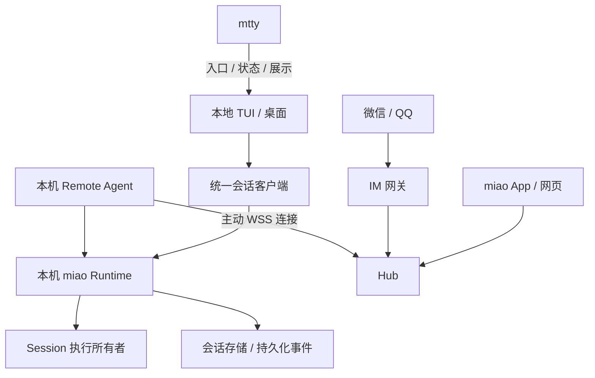

# miao Remote Control：统一会话接入技术方案

状态：拟议，2026-10-04。本文是架构与实施计划，不是已交付功能声明。

2026-10-06 修订：[随窗口运行方案与排期](window-runtime.md) 是本机生命周期的权威契约。
本地 Runtime 由本次 miao 运行拥有；不要求常驻服务、托管会话迁移或版本化执行 worker。
Hub 的独立部署、授权、E2EE、幂等和移动端恢复设计继续保留。

统一本机会话执行、客户端协议与远程接入。旧微信/QQ连接器、本机会话 Router 和 IM 守护进程已移除；后续 IM 网关应作为独立授权客户端重新实现，不能复用已删除的本机入口。
目标是让本地 TUI、miao App、网页和微信/QQ 操作同一个本机会话；执行、文件与模型凭证留在会话所属机器。

## 1. 产品目标与边界

- 在当前 Session 输入 `/remote-control`，选择 Web/App，通过界面完成中继配置、扫码或配对。微信/QQ 接入属于后续独立网关阶段。
- 本地与远端可交替发送 prompt、steer/queue、审批、问答和中断，并同步消息、工具活动与文件改动。
- 一个 Hub 可以接入家用电脑、笔记本和开发服务器；执行机器主动向 Hub 建立连接，不要求固定公网 IP 或入站端口。
- 提供本次运行期间的分享；关闭所属本地窗口，执行和 Remote Agent 一起结束，远程显示离线。
- `/remote` 可作为 `/remote-control` 的界面兼容别名；不需要用户管理后台 Runtime。

首版限定个人账号、多台执行主机、多个已配对客户端。团队权限、跨机器搬迁活动 Session、任意终端接管、
公网匿名写入、自动放行工具权限不在首版范围。mtty 的 PTY 存活与 miao 的 Session 执行存活分别管理。

### 1.1 实现交付范围与完成标准

本文明确要求实现 miao 本机侧、原生 iOS App 和自建中继 Hub 三部分；不是只给现有 Server 加端口转发，
也不是只提供 App 原型。本文仍是设计，不能据此宣称任一新增组件已经实现。

| 交付物             | 本轮要求                                                            | 可独立验收结果                                             |
| ------------------ | ------------------------------------------------------------------- | ---------------------------------------------------------- |
| miao Runtime/Agent | 统一执行归属、自动启动、配对授权、会话操作与恢复、出站连接          | 本地 TUI 与远端驱动同一 Session，不需额外 attach 命令      |
| iOS App            | Swift 原生 iPhone/iPad UI、语音输入、会话创建/操作、同步与后台恢复  | 手机独立完成选机器、选项目、开始任务、审批、看结果         |
| 自建 Hub           | 可部署服务、账号/设备目录、连接认证、双向转发、元数据存储及运维接口 | 两台执行机器通过主动连接接入，蜂窝网络客户端可操作各自会话 |
| mtty 集成          | 启动/状态/接入入口，遵守 miao 生命周期                              | pane 关闭结束所属执行和远程资源，不影响其他 pane           |
| IM 网关与网页      | 已设计的后续可独立交付项，复用同一协议                              | 微信/QQ 多主机操作，网页接入同一 Session                   |
| APNs               | 独立模块，配置完成后支持锁屏提醒                                    | 不运行 App 也可收到通用提醒，点击后核对真实状态            |

第一条完整可用链路为 Runtime + Agent + Hub + iOS App；网页、IM 多主机与 APNs 不阻塞前台链路交付，
但整个方案完成仍需按对应阶段交付，不能将“第一条链路可用”报告为全部完成。APNs 未交付时明确后台无通知。
第一条链路直接分享当前运行拥有的 Session，不迁移到托管进程；能力未交付前不宣称完整接入可用。

## 2. 当前实现与缺口

| 当前能力                      | 代码入口                                       | 本方案中的用途                           |
| ----------------------------- | ---------------------------------------------- | ---------------------------------------- |
| TUI 中继配置与设备授权        | `packages/tui/src/component/dialog-remote.tsx` | 配置中继并授权 App/Web 接入当前 Runtime  |
| 持久化 Session 历史及事件订阅 | `packages/protocol/src/groups/session.ts`      | 使用 `history` 和 `events?after=` 做恢复 |
| 进程内执行协调                | `packages/core/src/session/run-coordinator.ts` | 保留单进程内排序，补齐执行归属约束       |

旧 IM 本机 Router 已移除。统一接入由 Runtime + Agent + Hub 承担执行归属、授权和传输。
现有全局 `/api/event` 是实时通知流，不能替代持久化历史；Session 事件接口按 aggregate sequence
重放再订阅，用于断线恢复。未来 IM 网关复用相同授权协议并独立交付。

## 3. 架构与职责



| 组件           | 职责与权威状态                                                               |
| -------------- | ---------------------------------------------------------------------------- |
| Runtime        | 会话执行、输入接纳、工具审批、事件与数据；可复用现有 Core/Server，不重写内核 |
| Remote Agent   | 本机身份、远程连接、授权校验、操作分派、订阅与背压；可与 Runtime 同进程组合  |
| Hub            | 用户、设备目录、路由、连接状态与转发；不执行工具，不持有模型凭证             |
| IM 网关        | 平台凭证、主人绑定、命令解析、摘要与通知；作为被授权的客户端连接 Agent       |
| 统一会话客户端 | 提供一致的会话操作；本地直连与 Hub 传输可替换                                |
| App/网页       | UI、设备凭证、有限缓存、事件游标；不持有会话执行权                           |
| mtty           | pane/PTY、终端渲染、启动入口和状态展示；不成为 miao Session 的第二个执行内核 |

这些是逻辑边界，不要求各自成为一个进程。首版在本次运行中组合 Runtime 和按需 Agent，在中继主机上
分别运行 Hub 和 IM 网关。网络入口（Cloudflare、反向代理）独立于会话协议。

### 3.1 实现技术与组件边界

Runtime、Agent、Hub 和 IM 网关优先采用现有 TypeScript/Bun 技术栈；Runtime 复用 Core/Server，Agent
在宿主组合层调用明确的会话服务接口。Hub 是独立部署服务，只依赖 Schema/Protocol 及网络、认证、元数据存储，
不依赖 Core。网页复用现有 TS Client 与会话 UI；移动端优先原生 iOS App，Swift/SwiftUI 同时适配 iPhone/iPad，
共享公开协议而非直接引用 TS Client。mtty 的入口和展示保持 Rust，只调用公开协议。
加密实现单独选型，可使用成熟库或必要的原生/WASM 模块，不自行实现密码算法。

远程会话客户端不强行模拟完整 HTTP Server：先抽出 UI/Router 所需的会话操作与流订阅接口，再分别实现直连与
Hub 适配。现有 UI 的全局事件、项目文件、配置与集成查询依赖须列成明确白名单；无法安全支持的功能先隐藏。
不能为了复用完整 SDK 而开放凭证、任意文件或管理路由。

### 3.2 首个移动客户端：原生 iOS

首版实现一个同时支持 iPhone 和 iPad 的 Universal App，使用 Swift、SwiftUI、Swift Concurrency；
最低系统版本建议 iOS/iPadOS 17，实施前按测试设备确认。网页随后接入同一协议，Android 暂不列入首版。
客户端负责连接与展示，模型、工具与文件操作仍在原执行主机上，不在手机运行 miao 内核。

客户端模块包括 Swift 协议类型、认证/配对、Hub WebSocket 传输、E2EE 会话、事件 reducer、范围隔离缓存和
SwiftUI 界面。网络使用 URLSession/URLSessionWebSocketTask；并发状态通过 actor 等串行机制管理。
私钥与长期凭证存 Keychain；加密优先成熟实现，并验证 Swift 与 TS/Bun 的互操作，不默认两端算法和编码兼容。

公开 wire schema 需支持 Swift Codable 类型生成或受校验的手工映射：固定时间、ID、整数序列、可空字段、
联合类型 discriminator 和未知事件处理规则。使用共享 JSON 测试向量验证 Swift/TS 编解码、状态恢复及错误语义；
公开 Protocol 的 TS Client 生成流程照常运行，另维护 Swift 契约验证，不把 TS 运行时嵌入 App。

首版界面与能力：

- 添加自己的 Hub、扫码/手动配对、设备撤销、在线状态和兼容性说明。
- 主机 → 项目 → Session 列表，展示会话、工具活动、Markdown/代码和只读 diff。
- 发送 prompt、steer/queue、审批、问答及有目标的中断；发送状态区分未提交、已接纳与结果不明。
- 输入栏支持语音自动转文字、实时预览、编辑与确认发送；保留系统键盘听写。
- iPhone 使用单列导航；iPad 使用自适应多列，支持窗口缩放、分屏、横竖屏、外接键盘和 Dynamic Type。
- 每台设备独立配对；首版不通过 iCloud 自动复制设备身份，退出/撤销时清理范围缓存。

移动端不只接入已有会话：用户选择主机与授权项目后可以新建 Session、指定本机可用模型/agent、编辑标题、
在会话间切换并查看各会话等待状态。模型/agent 查询只返回显示和选择所需信息，不返回 provider 凭证或完整配置。
默认选择沿用目标 Runtime 的解析策略；不在手机配置模型密钥。归档/删除、fork、完整编辑器和交互终端后续设计，
能力未实现时不显示可操作入口。待处理审批/问答列表提供跨会话入口，不要求用户逐个打开会话查找。

Session 创建同样需要稳定 operationId 和可查询结果：本机保存 operationId → sessionId 的接纳映射，超时重试
不能创建两个会话。创建和第一条 prompt 分别有可恢复的接纳状态，避免会话已建但首条消息结果不明时重复创建。

iOS 切后台后不承诺 WebSocket 持续运行；回到前台重新认证、恢复目录与 Session 游标，不重发已接纳操作。
本机任务继续运行。需要锁屏通知时采用 APNs，作为独立交付项：由 Agent 产生最小化通知信号，经 Hub 推送，
默认只包含通用提示与不透明定位标识，不含 prompt、代码、审批正文或密钥；收到通知后打开 App 查询真实状态。
设备 token 更新、推送凭证保管及通知绑定撤销单独管理，不把推送送达视为审批/操作确认。

### 3.3 iOS 前后台状态机

前台实时连接是主要通道，后台不维持无限心跳或定时重连。进入后台不发送 Session interrupt、删除排队输入或
撤销分享；本机 Runtime 继续执行，遇到审批正常等待。用户关闭 App 不等于停止任务。

| 状态                  | 行为                                                  | UI / 恢复语义                            |
| --------------------- | ----------------------------------------------------- | ---------------------------------------- |
| foreground.connecting | 验证 Hub 与设备身份、协商能力、建立新连接密钥         | 展示连接中；缓存明确标为未同步           |
| foreground.syncing    | 重核授权和目录、核对操作结果、恢复 pending 与会话序列 | 历史可浏览；对应目标尚未就绪时禁用写操作 |
| foreground.ready      | 实时订阅、发送、处理确认                              | 显示本机接纳状态，不以网络写成功替代     |
| foreground.offline    | 停止发送，持久化草稿，有限退避重连                    | 显示离线与最后同步时间                   |
| background.draining   | 保存本地状态，短暂完成已开始的网络收尾                | 不启动新的业务操作或无限等待             |
| background.quiescent  | 关闭实时订阅和 socket，停止网络循环                   | 无需应用持续运行；允许系统挂起或终止     |
| authorization.blocked | 授权撤销、过期或密钥不可访问时停止数据面              | 需重新配对/解锁，不能以重连绕过          |

不要求 quiescent 状态的 Swift 代码收到“已挂起”回调。系统可能直接终止进程，所有恢复依据来自此前已持久化
状态。离开前台的回调只是尽力收尾，不能作为唯一保存时机。

SwiftUI scenePhase 由应用级 ConnectionCoordinator actor 汇总，按账号/Hub 管理共享连接。iPad 多窗口中
只要有一个需要实时数据的前台 scene 就保持订阅；短暂 inactive（系统提示、切换动画）不立即拆掉连接，全部
scene 进入后台才收尾。每个窗口保留自身导航目标，共享操作账本、认证和序列状态，避免多个窗口重复发送。

### 3.4 进入后台与恢复顺序

用户提交前先持久化草稿/操作意图及稳定 operationId/message ID，收到事件后把 reducer 状态与可恢复游标
作为一致检查点保存；不能只存新游标而保留旧状态。持久化缓存采用系统文件保护；设备密钥/凭证默认使用
ThisDeviceOnly 与解锁可用策略，首版不为后台刷新放宽密钥访问。仅清理敏感画面的展示，不删除未确认操作账本。

进入后台执行有限收尾：

1. 停止接纳新网络提交、订阅扩展和重连循环；已在账本中但未发出的意图保留。
2. 合并并写入草稿、操作状态、目录缓存、会话检查点与已消费通知标识。
3. 对已开始的用户提交，可申请 beginBackgroundTask 以短暂等待确认或完成本地写入；不承诺固定运行时长。
   expiration handler 立即取消网络等待并结束任务，结果不明保留为 awaitingConfirmation；正常完成也及时 end。
4. 尽力取消订阅并关闭 socket。即使 close 失败，服务端也用连接超时、epoch 与队列上限清理资源。

回到前台或冷启动恢复：

1. 读取本地检查点和未确认账本；若设备尚未解锁，显示待解锁，不绕过 Keychain 保护。
2. 认证、更新连接 epoch、重新协商 E2EE 密钥与授权，不跨连接复用流密码 nonce/序列状态。
3. 重核当前可见主机/Runtime/Session 目录，取消已失效授权与目标；处理通知导航但暂不信任通知里的业务状态。
4. 查询 awaitingConfirmation 操作的权威结果，重核审批/问答及 runGeneration，按第 5/7 节规则处理重试。
5. 从各个已订阅会话的有效游标补读；缓存或 schema 不兼容、游标过期时重取快照，不自动重新发送业务操作。
6. 对恢复完成且仍有写权限的目标启用输入；其他目标保留离线/同步状态，不等待全部历史加载完才显示 App。

恢复期间的取消、后台切换与旧网络响应通过连接 epoch 丢弃，旧回调不能更新新窗口或恢复已撤销权限。
系统终止/用户强制退出后再次启动也走相同流程，不依赖上次退出回调或后台刷新曾经运行。

### 3.5 未确认操作账本

账本键为授权主体、完整 Session 地址和 operationId，持久化操作种类、参数摘要、稳定 message ID、目标
requestId/runGeneration、创建时间及状态。正文仅在必要的草稿/恢复数据中保存，受文件保护，不写日志。

| 状态                     | 含义                                     | 恢复动作                              |
| ------------------------ | ---------------------------------------- | ------------------------------------- |
| draft                    | 尚未点击提交                             | 仅恢复编辑，不自动发送                |
| prepared                 | 已确认提交并写账本，但不能证明网络未发送 | 按结果不明处理，不生成新 ID           |
| awaitingConfirmation     | 请求已发送或正在发送，未取得权威结果     | 查询 operationId，不能推定失败        |
| accepted                 | 本机已持久化接纳 prompt                  | 补读会话，不重发、不因 App 退出而取消 |
| completed / rejected     | 操作结果明确                             | 同步状态，按保留策略清理              |
| outcomeUnknown / expired | 结果不可恢复或业务目标已失效             | 显示待核对/过期，不静默执行           |

Agent 提供受范围保护的 operation.get，区分已知结果、目标不存在和记录已过保留窗口，不能统一返回 not found。
prompt 在确认权限与 payload 未变时可以用原 message ID 精确重试；批准、问答和中断在后台恢复时默认先核对结果，
未知结果不自动重放。中断永远不迁移到新 runGeneration；恢复的审批须让用户重新看到当前真实请求再操作。
操作结果保留期限与客户端最大可重试期限通过能力协商公布；超过期限要求核对，不承诺无限期结果查询。

退出账号或切换账号立即关闭连接、清除该账号可见缓存和凭证，并停止通知绑定；未确认操作不会转投新账号。
本机已接纳任务继续运行，UI 在退出前解释其状态；可保留不含正文的失联操作标记，但不能保留可跨账号读取的内容。

### 3.6 APNs 通知数据面与交互

需要审批/问答、任务完成和错误触发提醒；不逐 token 推送。Agent 从已确认事实生成 notificationEventId，
只对当前授权且订阅提醒的设备发送最小化信号。Hub 的独立 Push Dispatcher 把目标绑定转成 APNs 请求，
任务执行不等待推送；推送故障不能影响 Session。锁屏通知无需设备私钥或本机 socket 即可展示通用提示。

载荷仅含通用本地化提示、版本、随机 notificationEventId 与受范围保护的 routeToken。routeToken 用于定位，
不是访问凭证；不包含主机名、目录、Session 标题、工具命令、正文或长期 grant 秘密。Hub 可见通知路由元数据，
不因 E2EE 宣称隐藏流量、事件时机等元数据。用户可关闭全部提醒或按设备/Session 调整。

采用 alert push 提供可见提醒；设置有界 TTL、按目标与提醒类别合并，避免旧进度覆盖审批提醒。审批提醒到期不超过
业务请求有效期；永久到期/已处理状态仍须由打开 App 后查验。APNs 接收只记为 providerAccepted，不记录为用户
已看到或已审批。拒绝、静音、专注模式、设备断网、推送延迟/丢失时，App 的 pending 列表仍可独立发现请求。

Push Dispatcher 采用有界重试队列，键为通知事件与设备绑定版本，去重且不持久化业务正文；发送前重新检查绑定、
授权确认与到期状态。失效 token 禁用，临时故障按响应退避，未知发送结果可造成重复提醒但不造成业务重复执行。
Agent 与 Hub 都重启时通过持久化事件和当前 pending 重核最小化提醒；任务完成提醒可合并，不承诺推送恰好一次。

通知权限与 APNs token 分别维护；token 不能充当身份凭证。注册绑定包含 deviceId、bundle topic、sandbox/production
环境和绑定版本，经认证且确认 Agent 授权后启用；每次系统返回 token 更新服务器，不能假设 token 永不变化。
登出/撤销使绑定与队列失效；已经交给 APNs 的提醒无法保证撤回，但通用内容无秘密，打开后的访问必须重新授权。
重装/Keychain 残留不能自动恢复旧通知身份，重新核验设备与安装绑定。用户关闭提醒不影响前台会话访问。

首版通知按钮只提供“打开会话/查看待处理”，不提供锁屏批准、文本快速回复或直接中断。点击后完成解锁、身份与
授权检查，再获取真实请求和当前状态。过期、重复、跨账号或伪造 routeToken 只显示安全的不可用提示，不执行操作。
前台已查看同一请求可以抑制重复横幅；badge 是需重核的提示值，不是可靠任务计数，不依赖 APNs 顺序维护状态。

### 3.7 后台刷新与交付约束

silent push / BGAppRefreshTask 只作为后续尽力更新缓存的优化，不能用于审批送达、持续同步或恢复保证；
首版无需它们实现正确性。不得借用音频、定位或 VoIP 保活。后台短时任务耗尽、通知未授权和系统不调度均按正常
退化路径处理，不导致任务中断或重复提交。附件后台上传/下载后续独立设计，不能把 background URLSession 当成
长期 WebSocket 运行机制。

D2 首个 App 交付前台同步、操作账本、前后台收尾/恢复、权限提示与状态展示；D3 分开交付 APNs 服务和网页。
自建 Hub 启用推送需要管理员配置 Apple 推送凭证及网络出口，不能把 APNs 私钥打包进 App；未配置时明确显示
“后台无通知，打开 App 查看”，而不是显示推送已开启。真机测试必须包含无调试器运行及 TestFlight 场景。

### 3.8 语音输入与自动转文字

语音输入列入 D2 iOS 首版，在聊天输入栏、键盘上方的输入工具区提供原生麦克风按钮；适配 iPhone/iPad，
外接键盘时也保持可用。保留系统输入法听写作为另一入口，App 将其结果按普通文本处理。首版不开发系统级
第三方键盘扩展，不修改系统键盘；App 自己的录音与转写运行在前台宿主进程。

交互为“点击开始 → 实时转写预览 → 点击停止 → 编辑文字 → 确认发送”。转写自动进行，发送由用户明确触发。
录音中展示可访问的录音状态、时长、停止和取消按钮，不只依赖颜色或波形；停止不等于提交 prompt。
识别为“允许”“停止”等词语仍然只是草稿，不直接执行审批、问答或中断。空结果禁用发送，已有文本不能被覆盖。

VoiceInputCoordinator actor 管理 AVAudioEngine、音频会话和识别任务；SpeechTranscriber 适配层优先使用兼容
最低系统版本的 Apple Speech API（SFSpeechRecognizer / SFSpeechAudioBufferRecognitionRequest），后续新 API
按版本与能力选择。识别语言首版提供普通话/英语与显式选择，按设备语言建议默认值；中英混说、代码符号和
项目名准确率通过真机测试评估，不承诺自动翻译或代码拼写准确。长输入可分多段录入，服务时限到达时保留结果。

### 3.8.1 转写位置、权限与隐私

优先使用设备端识别。启动前按语言检查 supportsOnDeviceRecognition，使用设备端模式时明确设置
requiresOnDeviceRecognition 并验证任务可用；“使用 Apple Speech”不自动等同离线处理。
设备/语言不支持或服务不可用时，保留文字及系统听写入口；如提供 Apple 在线识别，须先明确说明音频会由 Apple
处理并取得用户选择，不能从设备端失败静默切到在线。首版不新增 Hub 音频上传或第三方 STT 服务。

首次点击麦克风时才按需请求录音和 Speech 授权，在 Info.plist 配置 NSMicrophoneUsageDescription 与
NSSpeechRecognitionUsageDescription。拒绝、系统限制或权限撤销时显示原因与系统设置入口，不阻塞普通文字输入。
App 管理自身录音权限，不替系统键盘听写请求或改变设置。

原始音频仅保留于识别所需的有限内存缓冲，首版不写文件、不进入草稿缓存、日志、Hub 或模型上下文；结束/取消时
释放音频缓冲。仅用户确认后的文本经现有 E2EE 会话协议提交。在线识别与系统听写有各自平台处理边界，不能把
会话 E2EE 解释为所有转写都端到端保密。可编辑草稿按现有文件保护策略存储，不作为诊断日志。

### 3.8.2 草稿一致性与前后台行为

录音开始时绑定授权主体、完整 Session 地址、窗口与 draftRevision，并保存原草稿和插入位置。partial result
替换本次识别的预览片段，不逐次 append，防止重复词句；final result 只合并一次。识别结果不得清空原草稿。
录音期间需要手动编辑、移动插入位置或发送时，先停止识别并确认预览，避免晚到回调覆盖编辑。

状态机为 idle → requestingPermission → recording → finalizing → editable，失败进入 recoverableError。
取消回到原草稿；完成返回可编辑状态。用识别 generation 丢弃旧任务回调，只有正式点击发送才创建 operationId
并进入操作账本。不能用音频任务重启来重试已提交 prompt。

切换 Session/账号、撤销授权或进入后台立即停止录音；取消识别并丢弃晚到回调，不自动重启麦克风。已显示的转写
预览可作为“未完成转写”保留在原 Session 草稿，账号退出则按退出缓存策略清理，不迁移到新会话。
电话/Siri/音频中断、耳机断连与录音路由变化时停止，保留已取得文字并提示继续录入；不在用户不知情时更换麦克风
继续录音。临时 inactive 不必然停止，但受系统音频中断控制；全部 scene 后台时停止。

应用级音频协调保证同一时刻一个录音任务，iPad 其他窗口可查看状态但不能争抢麦克风。转写失败不丢已有文本，
离线设备端识别可生成草稿但不能向离线主机提交。音频会话退出时移除 tap、停止 engine、释放识别任务并恢复其他
音频使用；音量数据与 UI 更新有界节流，不把音频复制进会话事件流。

开发和发布需要支持所选 SDK 的 macOS/Xcode 构建环境；模拟器覆盖两种设备，真机验证扫码、弱网、后台恢复与
Keychain。签名与 TestFlight/App Store 分发需要相应 Apple 开发者配置；证书、团队配置及 APNs 凭证放私有配置。

## 4. 执行归属与生命周期

每个活动 Session 只有一个执行所有者；远程客户端断开、分享撤销、Hub 重启都不转移执行权。
本地所属窗口关闭则终止其执行和 Agent；详见 [随窗口运行](window-runtime.md)。
Session 地址包含 `hostId + runtimeId + sessionId`，runtimeId 标识一次运行，重启后变化；
host/设备身份可以持久化，不从 IP、主机名或 PID 推导。历史缓存以稳定 host/storage/Session 身份关联，
操作、连接和订阅额外绑定本次 runtimeId/epoch，不能仅用 sessionId 或把旧授权连接当成新运行。
Agent 注册新连接时作废本运行的旧连接 epoch，旧消息不得恢复路由权或改变新连接状态。

### 4.1 窗口拥有本地运行

每次 miao 启动拥有自己的固定版本运行时。共享历史库使用 WAL/事务，数据库迁移和维护有独立保护；
同 Session 的执行使用内核排他锁，进程内 coordinator 保留。不同 Session 可在不同窗口同时执行。
不能通过仅移除整库锁实现并发，也不能用 lease 心跳过期抢占仍活着的工具进程。
所有 CLI/TUI、run、ACP、serve 和桌面入口遵守这些保护；别名路径规范化，运行通道保持分离。

关窗/退出/ACP EOF 停止本运行的新接纳、远程连接、执行和自有工具子进程，有界清理后释放锁。
后台任务、远程连接和队列不能 pin 进程。服务崩溃后保留历史和 admitted 输入，恢复由用户显式发起；
未完成外部工具副作用需要核对，不能因重连盲目重跑，也不能修复其他活跃窗口的工作状态。
显式 attach 不拥有服务，退出只关闭其连接；显式前台 serve 随启动它的进程结束。

### 4.2 原地分享当前会话

`/remote-control` 在当前运行按需开启 Agent，分享它已拥有且已授权的 Session。
不迁移到托管服务，不实现热交接，也不因磁盘上存在配置就默认保持后台服务。
关闭 remote 入口不结束本地执行；关闭所属本地窗口则 Agent/监听/重连一起关闭，Hub 显示离线。
其他窗口自己的运行和远程连接保持独立；用户随后显式继续会话时建立新的运行身份与连接。

## 5. 统一协议与传输

保留依赖方向：Schema 定义数据，Protocol 定义公开契约，Core 实现执行，Server 暴露协议；Client 不依赖
Core/Server，miao 宿主负责组合。不要复制各客户端的审批与输入逻辑，也不要让 Hub 代理任意本机 HTTP URL。

新增 Hub 传输适配层，复用现有会话请求/响应 schema；数据面仅允许显式注册的操作。控制面负责配对、连接、
授权和能力协商。Web 的连接管理不应混进 IM Connector；它们共享会话访问与授权层。

建议的传输信封（字段及版本需要实现前定稿）：

```text
protocolVersion, connectionId, connectionEpoch, operationId, hostId, runtimeId,
sessionId?, operation, subscriptionId?, grantId, payload
```

operationId 标识一次业务操作，在重连重试时保持不变；与审批/问答的业务 requestId 分开。连接 ID 每次更新。
支持响应关联、请求超时和订阅关闭。取消等待或网络超时不撤销已接纳输入，也不默认中断执行；结果不明时查询
原 operationId，不能生成新 ID 再提交。本机按主体、完整会话地址、操作 ID 和规范化 payload 校验精确重试；
同 ID 不同参数返回冲突，不能以再次执行作为恢复方式。
本机只在请求已持久化接纳后返回 `accepted`，Hub 收到或网络发送完成只能记为 `sent`。

prompt 的操作 ID 映射到显式 message ID，输入及接纳结果遵循现有事务语义。其他写操作需要独立定义结果记录及
崩溃恢复规则；不可将通用 dedup 表与副作用简单分两步写入后承诺恰好一次。瞬时操作结果无法确认时返回
`outcome_unknown` 并同步当前状态，客户端不得自动重放。

能力协商至少包含协议版本、会话事件版本、prompt/steer/queue、审批、问答、中断、附件支持及消息大小限制。
能力缺失、权限不足、主机离线和协议不兼容分别返回可诊断错误。

## 6. 身份、授权与加密

### 6.1 三类授权对象

- 用户：Hub 登录身份；各 IM 平台用户经一次性流程绑定到它。
- 设备：主机与客户端公钥及稳定 ID；首次配对须在已授权端确认，有期限、尝试限制和撤销能力。
- Grant：访问主体、主机、项目、Session 范围、操作集合、有效期和撤销状态。

Grant 与 Session 生命周期独立。长期设备授权与临时分享分别管理。权限至少区分 read、prompt、permission.reply、
question.reply、interrupt、session.create 和 device.admin；只读客户端在 Agent 端禁止写入。
permission.reply 默认只允许本次允许或拒绝；永久保存工具规则需要独立的 permission.policy.write 授权。
连接器登录/解绑、设备管理与配置修改属于管理面，不因拥有会话写权限而开放。
新建会话仅允许授权项目，禁止远端提供任意目录或跳过本机工具审批。

列表、搜索、历史、事件、pending、diff 和文件读取同样受范围约束，授权外的会话标题与项目路径不能泄露。
项目范围基于本机已注册的项目/Location 身份，不能以远端目录字符串前缀判断；文件读取须防路径穿越和符号链接
越界。Agent 在每次分派前检查授权，在撤销/到期时关闭对应订阅并丢弃未分派写请求；已接纳任务继续运行。

授权最终由 Agent 执行，不因 Hub 转发成功就被接受。授权绑定主体公钥；修改、扩权与撤销需要可验证的授权来源。
主机保留授权版本并拒绝旧版本重放；密钥与撤销记录持久化。Hub 负责同步与路由，不能单独签发本机操作权。

首次用户创建与主机注册可用部署管理员的一次性 bootstrap，但 Hub 登录成功仅提供目录权限。客户端公钥首次授权
必须由本机或该主机已有管理员确认，并以双方 challenge 绑定公钥、目标和授权范围，不能直接信任 Hub 提供的公钥。
短配对码仅用于关联流程，具有速率与尝试上限，不作为长期密钥。主机保存可信管理公钥；丢失全部管理凭证后的
恢复要求本机确认，不允许仅通过 Hub 重置夺取执行权限。离线撤销显示“等待主机确认”，主机应用撤销版本前
不得在界面宣称已完成；重连完成授权同步后才开放数据面。

### 6.2 两条信任路径

| 路径                        | 内容可见方                      | 设计                                                  |
| --------------------------- | ------------------------------- | ----------------------------------------------------- |
| App/网页 ↔ Agent           | 两端；Hub/Cloudflare 只转发密文 | E2EE、身份绑定、每连接密钥、完整性与防重放            |
| 微信/QQ ↔ IM 网关 ↔ Agent | IM 平台、网关、本机             | 网关作为独立授权客户端，限制范围；不宣称整条路径 E2EE |

浏览器代码来源仍是信任边界；E2EE 不保护恶意网页脚本。静态前端资源需要受控发布、依赖与资源完整性管理。
加密协议采用成熟方案和实现，单独评审，并验证身份绑定、握手、防重放和密钥生命周期。

分享链接不包含本机 Server 密码。短期秘密放 URL fragment，不写日志；配对完成换设备凭证。查询授权时脱敏。
原有 IM 凭证继续采用受保护存储与原子写，不纳入 provider 凭证列表。审计记录主体、范围、操作 ID 和结果，默认不记正文。

## 7. 多端同步、重连与背压

1. 读取会话快照及对应的持久化事件序列水位，再从该水位订阅；若无法原子取得快照与水位，采用已验证的
   subscribe/buffer/snapshot 协议，禁止简单的“先取历史再订阅”留下事件空洞。
2. 使用 `session.events?after=<seq>` 重放并订阅，按 Session 序列去重与排序；游标只在状态应用成功后推进。
3. 持久化事件与临时 token/progress 分开：前者负责恢复事实，后者可合并或丢弃，并在重连后由事实重建。
4. 审批、问答等等待状态恢复时另查当前 pending 集合，不能只依赖全局实时流恰好收到通知。
5. 输入接纳复用现有稳定 message ID 重试语义；审批、问答和中断单独定义幂等/已处理结果，不能假设所有端点已具备。
6. 各客户端有独立、有界的队列和字节预算；网络发送不阻塞 runner。超过上限关闭订阅或请求重同步，不无限缓存。
7. 重连使用心跳和带随机抖动的指数退避；版本或凭证错误停止无效重试并显示可恢复原因。

同一会话本地与远端输入由 Runtime 排序；审批第一次有效提交生效，其余客户端刷新为已处理。写权限允许多端输入，
不意味着多个 runner。附件后续增加上传限额、项目范围校验和流量预算，不经过全局剪贴板路径传输。

中断是有目标的瞬时操作：绑定 Runtime 执行 epoch 与当前 runGeneration，不能把重试的旧中断应用到后续任务。
现有 interrupt 会保留已排队输入并可能启动后继 drain，因此 UI 应表达为“中断当前执行”，不承诺清空队列或
永久暂停会话。清空/暂停作为独立能力设计。审批/问答同时携带原 requestId；进程重启失效的请求应显示过期，
不能把查询 pending 为空当成已批准，也不能静默重新批准新的请求。

Session 序列不承诺连续递增；客户端用服务端提供的有效水位和重同步标记判断缺口，不能仅因数值跳跃断定漏事件。
从服务发现先订阅可见会话目录变更，再取授权内目录快照并重核，覆盖新会话、删除、状态和 pending 变化。
目录可以通过有界实时提示加周期性重核恢复，不必依赖全局通知流持久化；永久连接一条当前 Session 流不足以
实现设备列表和跨会话审批通知。切换主机、退出登录或撤销权限时清理旧订阅与内存缓存，受限事件不得混入新视图。

首版 Hub 不持久化 prompt 或会话正文。离线时客户端保存草稿，重连后经用户策略与相同操作 ID 提交。
IM 入站去重与操作 ID 必须在交付确认前持久化，以覆盖进程重启后的重复投递；平台已接收不等于用户已看到回复。

现有 Router 的 prompt 未显式提供稳定 message ID，现有入站去重也不能直接视为跨重启保证。新增收件箱保存
平台账号、发送者、平台消息 ID、已解析的目标与稳定 operationId/message ID；先保存再推进可控游标。
重投使用第一次解析的目标，不能因用户已切换 `/host` 或 `/use` 而发送到另一会话。结果推送失败继续进入待取
状态；通道缺少可靠消息 ID 时明确降级策略，不承诺无限期去重。

## 8. `/remote-control` 与 mtty 集成

当前界面选择 Web/App；未来独立 IM 网关交付后再添加微信/QQ。然后选择范围（当前 Session、当前项目、已授权项目）和持续方式。
选择接入后自动检查服务、登录/配对、建立授权、绑定当前 Session，再验证可操作性；正常流程不要求补输命令。
平台需要额外配置时以向导呈现。命令与日志保留在高级诊断，不作为正常接入步骤。

状态明确区分未登录、已登录但未接入、连接中、已连接、重试中、离线、授权撤销和需重新登录。
账号凭证有效时自动恢复连接；“持续接入”首次明确告知后台运行及登录自动启动行为，后续不重复要求扫码。
系统权限或不支持的环境通过界面解释，不能仅隐藏失败。

Web/App 首次配置 Hub 与配对，此后可从设备列表持续访问。临时 Session 分享提供链接、二维码、只读/可操作与 TTL。
IM 保留 `/list /use /new /queue /stop /r`，新增 `/hosts /host`；当前主机、会话编号和审批编号以用户隔离，
审批编号绑定 hostId、sessionId 和 requestId，切换主机不能造成误批。

mtty 提供“远程接入…”入口、连接状态和二维码展示，调用 miao 的公开接口；不管理第二套凭证或启动第二个 runner。
缺少协议能力的版本隐藏不支持操作并说明原因。GUI/CLI 更新或 pane 关闭的生命周期须在验收中覆盖。

## 9. 部署

### 9.1 Hub 必须实现的服务范围

Hub 优先以独立 TS/Bun 服务交付，首版可设 `packages/hub`；iOS 源码独立于 Bun workspace（例如 `apps/ios`），
Swift 契约测试与构建单独配置。实际目录落地时检查仓库规则，不将 iOS 工程混入 TS 类型检查。

| Hub 模块       | 必需能力与边界                                                                                |
| -------------- | --------------------------------------------------------------------------------------------- |
| 初始化与登录   | 私有配置的一次性管理员初始化、后续账号认证、令牌轮换与注销；不提供开放注册                    |
| 用户/设备目录  | 稳定身份、主机与 Runtime 注册、名称与在线状态；目录按账号隔离                                 |
| 连接认证与路由 | Agent/client 分开的认证角色，双方主动 WSS 接入，配对后建立受范围约束的逻辑通道                |
| 连接复用       | 一条连接承载多会话请求与订阅，以 opaque channel/subscription ID 关联；连接 epoch 防旧连接覆盖 |
| 公共控制面     | 版本/能力、目录、配对步骤、连接状态、注销与通知绑定；不通过它读取本机会话正文                 |
| 密文数据面     | 严格帧格式、大小与角色检查、受控转发；不解密 App 的会话操作，不伪造 Agent 的确认              |
| 元数据持久化   | 用户、设备公钥、已确认授权索引、通知绑定和 schema 版本；Agent 的授权为最终权威                |
| 资源管理       | 每主体/主机的连接数、订阅数、预认证超时、帧上限、总待发字节预算与限流                         |
| 运行维护       | health/readiness、结构化错误、脱敏日志、连接/积压指标、优雅退出与版本兼容                     |

账号登录采用成熟认证实现，并区分 Hub 目录访问令牌与 Agent 操作授权；短期访问令牌、刷新/注销及客户端存储
规则在实现前定稿。不要以长期开启的配对码或一次性 bootstrap 作为日常登录凭证。
Hub 收到路由目标时检查主体与逻辑通道绑定，不能让客户端枚举或向其他账号的 Agent 任意转发。配对流程有
期限、尝试限制和取消，代理入口不替代这些检查。

App 发操作和 Agent 返回结果经同一个双向通道关联；远程事件也通过 Hub 上同一订阅协议转发，不能让手机另行
连接家中 SSE 地址。客户端只需 Hub 地址，Agent 只需出站连接；连接状态区分 Hub 不可达、Agent 离线、认证失败、
版本不兼容和订阅恢复中。Hub 显示在线只代表已认证连接存活，不代表 Runtime 已就绪或会话正在执行。

首版元数据可使用 SQLite，schema 迁移、备份与恢复提供显式流程；备份不包含会话正文、模型凭证或设备私钥。
恢复后重新核对 Agent 授权，不能用旧备份复活已撤销 grant。Hub 重启不恢复旧连接 epoch，客户端重新认证建链；
优雅退出停止新连接、通知现有连接重试，禁止无限 drain。规模扩大前不做多实例粘性路由或分布式消息队列。

### 9.2 部署产物与私有配置

中继设备若能运行 Linux/Docker，部署 Hub、独立 IM 网关及静态网页；若仅是路由器，中继服务放在其后主机。
域名、设备地址、用户名、凭证与部署路径全部放私有配置，不进入公开仓库。

第一条链路的部署不要求同时安装 IM 网关、静态网页或 APNs；提供 Hub 容器镜像/构建定义、最小部署模板、
占位配置示例、持久化卷、健康检查与管理员初始化步骤。通用模板可以公开；真实设备配置、域名、密钥与证书
放仓库外私有目录。升级支持协议兼容检查、数据库迁移检查与备份；镜像回滚不能假设数据库可直接降级。

推荐固定 Cloudflare Tunnel 映射到 Hub：动态公网 IP 无需更新，通常无需端口转发。可选端口转发 + Cloudflare
代理，此时需源站 TLS、入站可达及动态 DNS 更新。两种方式均使用应用自身设备认证和授权。
WebSocket 心跳与代理超时需配套；Cloudflare 更新、Hub 重启等连接中断必须自动恢复。

首版单 Hub 实例与本地持久化元数据即可；备份身份/设备/授权数据。Hub 离线不影响本机执行，但跨端接入不可用；
主机睡眠或断电显示离线，不承诺远程唤醒。只读分享也可能泄露项目内容，须限定访问范围。

### 9.3 交付前仍须确定的环境参数

管理员部署前确认中继设备的系统/CPU 架构、是否能运行 Docker 或 Bun、出站网络、持久化空间、TLS 入口和域名；
这些是部署输入，不改变 Hub 必须实现的功能。iOS 签名与 APNs 凭证另行配置。平台支持清单、资源预算、令牌与
操作结果保留期限、Swift/TS wire schema 和具体加密协议属于实施前必须定稿的参数，不应边开发边隐式改变。

## 10. 分阶段迁移与验收

| 阶段           | 可独立交付内容                                                               | 验收门槛                                                                            |
| -------------- | ---------------------------------------------------------------------------- | ----------------------------------------------------------------------------------- |
| A：执行归属    | 窗口拥有运行、共享库迁移保护、同 Session 排他锁、旧 owner 清理               | 异 Session 并发；同 Session 单写者；关闭 pane 结束所属任务且不影响其他窗口          |
| B：统一入口    | `/remote-control` 与 `/remote` 别名、中继配置、App/Web 当前运行 Session 绑定 | 无额外命令完成中继配置、设备配对及当前会话操作；取消/失败不显示成功                 |
| C：恢复与多端  | 会话访问接口、快照水位、目录恢复、幂等、审批恢复、背压                       | 本地多客户端先验证；换网无持久化事件空洞；旧中断不停止新执行                        |
| D1：Hub/Agent  | 主机注册、设备授权、E2EE、远程传输、Swift/TS 互操作契约                      | 依赖 C；两主机与多 Runtime 可区分；权限在 Agent 校验；版本不匹配可诊断              |
| D2：iOS App    | Swift/SwiftUI Universal App、配对、列表、会话操作、语音转文字、后台恢复      | 依赖 D1；iPhone/iPad 真机接入同一 Session；转写可编辑且不自动提交；共享协议向量通过 |
| D3：其他客户端 | 网页复用现有 UI，APNs 通知独立交付                                           | 复用已验证协议；通知不泄露正文、不视为操作确认                                      |
| E：IM 多主机   | 独立网关、跨主机 Router、身份绑定与通知                                      | 一个账号切换两主机；重启投递不重复；审批不串主机                                    |
| F：分享扩展    | 在 B 已有原地分享基础上扩展授权范围与客户端能力                              | 保持原所有者；TTL/撤销阻断后续操作；不新增热交接或常驻模式                          |

A/B 优先按 [窗口运行排期](window-runtime.md) 实施；B 直接分享当前运行，无需托管迁移。旧本机 IM 已移除，后续网关走 E。
C/D 完成之前不宣称公网同步可用；D 的公网写入上线以前必须完成授权、加密及相关安全验证。
每阶段拆为单一 concern 的短期分支和 PR，不将多阶段重构堆在一个长期分支。

验证包括真实 Runtime 与客户端集成、假 IM 平台、受控网络中断和真机 UI：

- 本地开始任务后手机继续发送、审批和中断，本地及时同步；多端操作有确定顺序。
- 主机 IP 改变、手机换网、Hub 重启、订阅积压后恢复；快照/订阅交界并发事件不丢失。
- 在“本机接纳完成但响应丢失”时重试；操作 ID 冲突拒绝，精确重试返回原结果。
- 陌生客户端、只读写入、超范围项目、新建任意目录、撤销授权和重放旧授权均被 Agent 拒绝。
- 所有本地执行入口竞争同一 Session、共享库迁移保护、别名路径、伪造服务端点和进程退出覆盖执行归属；未完成工具副作用不盲目重跑。
- 两主机相同 sessionId、多 Runtime、旧连接迟到与切换主机覆盖缓存/路由隔离；撤销后订阅和未分派写入停止。
- 中断响应丢失后启动下一任务，旧操作重试不影响新执行；审批冲突和永久允许越权均被拒绝。
- 网关在保存入站、发送请求、收到接纳、推进游标各阶段崩溃；重投保持目标及操作 ID，不因切换会话误投。
- 微信/QQ 真机扫码、凭证失效、平台回复限制、审批冲突和待取结果；App/网页配对与撤销。
- iPhone/iPad：分屏与尺寸变化、键盘和辅助功能；锁屏/后台/网络切换后补读不重发；Swift/TS 编解码及 E2EE 互操作。
- iOS 提交前、网络发送中、本机已接纳但响应未到各阶段切后台/终止；恢复保持原操作 ID，不重发审批或中断。
- iPad 多窗口 active/inactive/background 组合，最后一个前台 scene 消失才收尾；过期回调不能影响新连接。
- APNs 不可用、拒绝提醒、低电量、断网、延迟/重复/乱序和 token 轮换；无后台刷新仍能前台恢复所有业务事实。
- 通知打开前请求已处理、设备已撤销、账号已切换；不泄露正文、不因点击提醒执行操作。
- 重装与设备重启未解锁、文件保护/Keychain 不可用、检查点与游标一致性及超出操作记录保留期限。
- 语音：普通话/英语、中英混说、代码名词、partial 修订和已有草稿插入；不重复、不覆盖、不自动提交。
- 麦克风/Speech 权限拒绝、设备端不可用、在线选择、断网、识别时限、电话/耳机中断、切后台及 iPad 多窗口竞争。
- 取消与切换 Session 后晚到回调、手工编辑竞争、转写失败后保留文本；原始音频不落盘、不进入 Hub/日志。
- 中继全新部署/初始化、两主机出站注册、蜂窝客户端接入、Hub 重启/旧连接、资源上限及备份恢复后撤销不复活。
- 手机新建会话和首条 prompt 确认丢失后恢复，只生成一个 Session；可用模型/agent 选择不暴露密钥。

变更公开 Protocol/HttpApi 后按仓库规则重新生成 Client；在相关包运行 typecheck 和针对性测试。
原生/Rust 编译和测试只在批准的远程构建主机执行。本文文档变更只进行链接、差异和隐私检查，不进行编译。
