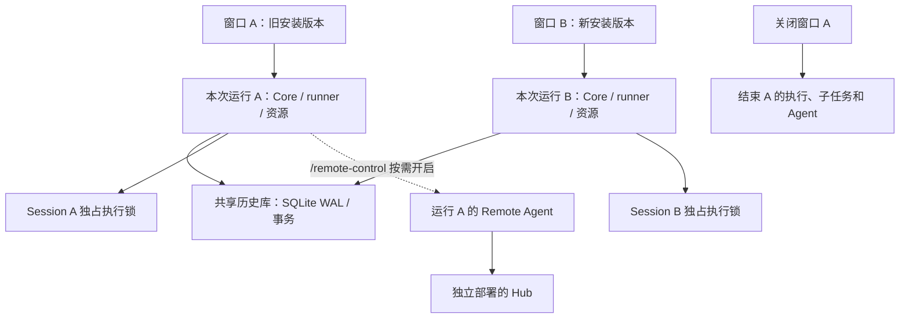

# miao 随窗口运行：生命周期、升级与实施排期

状态：正确性复核、实现与平台验收已完成；正式发布见 #253；2026-10-06。调查基线：`7ee599413`。
本文替代常驻 Runtime、空闲保活和版本化执行 worker 的路线。
文档与代码交付分别记录；只有完成验收的代码 PR 才代表运行行为改变。
实施跟踪：[GitHub #253](https://github.com/oxdingzg/miao/issues/253)，计划合并后保持打开，逐项验收后关闭。

## 1. 产品契约

- 每次普通 `miao` 启动拥有自己的运行时和加载版本；关闭该终端 pane 或退出 CLI，运行时一起结束。
- 安装更新只改变后续启动所用的程序。旧窗口的 UI、runner、provider 和工具继续使用该次启动的版本，
  不在下一个 provider turn 切版本，不被新窗口停止，不热重启。
- 新窗口的 UI 和执行代码都来自新安装的版本；不能仅更新 UI、继续复用旧 daemon。
- `/remote-control` 按需为当前运行开启远程接入；退出或关闭所属窗口同时关闭 Agent、监听器、订阅和重连。
  远程连接、等待审批、后台子任务、队列和定时任务都不能延长本地窗口的生命周期。
- 历史和已接纳输入继续持久化；退出不是删除会话。重新打开后由用户显式继续，不能偷偷重放中断的工具或模型调用。
- 多窗口可使用同一历史库、同时执行不同 Session；同一 Session 只能有一个本地执行所有者。
  第二窗口默认可看历史，写入/继续时明确提示已有所有者；不自动接管，也不自动把新窗口变成旧版本的执行客户端。
- `miao serve` / 显式 attach 是主动启动和连接的前台服务：服务活到启动它的进程退出。
  attach 客户端退出只关闭自己的连接。默认启动不创建 detached daemon，不安装 launchd/systemd，不设计服务自动替换。
- `miao run` 随命令结束清理；ACP 随 stdio EOF、宿主退出或信号清理。mtty 关闭 pane 必须终止其拥有的 miao。
  tmux/screen 中保留 pane 意味着进程仍存活；手机关闭或暂时断网不等于本地 pane 关闭。

## 2. 外部参照与证据范围

核对日期：2026-10-06。以下区分文档明示与工程推断，不将 CLI、桌面程序、云任务混为一谈。

| 产品/入口                         | 官方确认                                                                                  | 对 miao 的启示                                               |
| --------------------------------- | ----------------------------------------------------------------------------------------- | ------------------------------------------------------------ |
| Claude Code 原生 CLI              | 启动及运行期间检查更新，后台下载安装，下次启动生效；原生 launcher 指向版本目录            | 当前运行固定版本，更新只影响未来启动                         |
| Claude Code 交互式 Remote Control | 每交互进程一个远程会话；本地进程必须存活，关闭终端后离线；还提供显式前台 server 模式      | 分享当前进程的会话，随宿主结束                               |
| Codex CLI                         | `codex` 启动 TUI；`/quit`、`/exit` 退出 CLI；安装页给出更新命令                           | 普通交互入口应易于启动和退出                                 |
| Codex app-server / Remote Control | app-server 默认 stdio；Remote Control 支持前台运行，也有显式 `start` / `stop` daemon 模式 | 有服务接口不等于普通窗口必须复用后台服务；不照搬 daemon 模式 |
| Codex 桌面宿主 Remote             | 宿主 App 关闭后远程访问停止，需保持 App 运行                                              | 远程可用性依附宿主，不能由“daemon”一词推断退出行为           |

来源：

- [Claude Code 更新与安装](https://code.claude.com/docs/en/setup#auto-updates)。
- [Claude Code Remote Control](https://code.claude.com/docs/en/remote-control#limitations)。
- [Codex CLI](https://learn.chatgpt.com/docs/codex/cli)。
- [Codex CLI 命令与退出、Remote Control](https://learn.chatgpt.com/docs/developer-commands?surface=cli)。
- [Codex app-server 传输与启动方式](https://learn.chatgpt.com/docs/app-server)。
- [Codex 桌面远程连接与宿主生命周期](https://learn.chatgpt.com/docs/remote-connections)。

Claude Code 的升级生效时机和 Remote Control 退出语义有明确文档。
所查 Codex 文档不能证明它与 Claude Code 使用相同的后台自动更新机制，也不能证明所有 Codex 模式都不常驻。
本机 `codex-cli 0.160.0` 的只读 help 同样确认显式 daemon start/stop；未为调查启动、停止或修改用户的 Codex 服务。
官方确认桌面宿主 App 关闭后远程访问停止，但不等于已证明所有子进程都被回收，也不等于关闭单个窗口就是退出 App。
显式 CLI daemon 是否与某个 UI 生命周期绑定，在本次证据范围内未确认；不能把它当成“Codex 关窗还常驻”的结论。

“继续跑内存中的旧版本”是方向正确的简述：编译后的进程继续执行已加载/映射的代码。
这不保证整个程序和依赖都驻留内存，也不保证延迟加载插件、资源、包管理器目录或后续启动的子进程不受磁盘更新影响。
因此需要固定本次运行的代码/资源路径，保留在用版本；不能只靠覆盖当前可执行文件。

## 3. 调查基线（实施前）

| 范围             | 现有实现与问题                                                                                                                          | 改造位置                                                                  |
| ---------------- | --------------------------------------------------------------------------------------------------------------------------------------- | ------------------------------------------------------------------------- |
| 发布/预览入口    | 稳定命令安装到 `~/.miao/bin/miao`；本地预览脚本构建 `packages/miao`                                                                     | `install`、`install.ps1`、`script/install-local.sh`、release workflow     |
| 旧 CLI 默认 TUI  | `!external` 时 `RuntimeConnect.ensure`；Worker/RPC 分支仍在，但默认不会走到                                                             | `packages/miao/src/cli/cmd/tui.ts`、`cli/tui/worker.ts`                   |
| 旧 CLI run / ACP | 默认同样 ensure 全库共享 Runtime；ACP EOF 只清理 adapter                                                                                | `packages/miao/src/cli/cmd/run.ts`、`acp.ts`                              |
| Runtime 启动     | `connect.ts` detached spawn、`unref()`；所有窗口加入同库 owner，版本差异只警告                                                          | `packages/miao/src/runtime/connect.ts`、`host.ts`                         |
| 新 CLI           | `default` / API / debug 通过 Daemon；detached `serve --register`，共享 `server.json`                                                    | `packages/cli/src/services/daemon.ts`、`commands/handlers`                |
| 新 CLI 版本冲突  | `start()` 遇不同版本的健康 daemon 会先 `stopProcess`；源码模式也不会复用健康 daemon                                                     | 同上；可能中断另一窗口工作，必须一起移除                                  |
| 整库锁           | `Database.layerFromPath` 在打开/迁移前取 `RuntimeOwnership.acquireShared`；跨进程独占全库                                               | `packages/core/src/database/database.ts`、`runtime/ownership.ts`          |
| 现有多进程基础   | participant 数据库层及 `SessionLease` 已存在；本地 execution 尚未接入 SessionLease                                                      | `database/migration.ts`、`session/lease.ts`、`session/execution/local.ts` |
| 活动/保活基础    | `RuntimeActivity`、linger 配置已落地；`host.ts` 尚未接入自动退出判断                                                                    | `core/src/runtime/activity.ts`、`miao/src/runtime/lifetime.ts`            |
| 远程             | host 启动时创建 ControlAgent，配置能建立出站连接；它依附共享 Runtime                                                                    | `packages/miao/src/runtime/control-agent.ts`、TUI remote dialog           |
| 自动升级         | `cli/upgrade.ts` 已有锁、缓存、通知和不重启当前进程的意图；TUI 默认 Runtime 分支跳过下方 Worker 的 `checkUpgrade` 调用                  | 核对所有发布入口，迁移为运行作用域内的后台任务                            |
| 安装原子性       | Unix 下载用临时目录后 `mv`，本地 binary 路径直接 `cp`；跨文件系统 mv 与覆盖复制不构成统一的原子安装契约；Windows 有 staging、验证、备份 | 安装器与 `installation/windows.ts`                                        |

当前能保证“安装不会主动重启旧 Runtime”，却不能保证“新窗口由新执行代码运行”。
把 linger 设为 0 也无济于事：其他窗口、执行或 remote pin 仍可保留旧 owner。
不能仅恢复 Worker 分支或删掉 detached：全库锁会拒绝第二个窗口，进程内事件/协调器又无法独自保护跨进程执行。

## 4. 目标结构与实施边界

逻辑边界保留 Schema → Core/Protocol → Server，Client 不依赖 Core/Server；宿主负责组合。
本地 API 在窗口进程内持有独立 Scope，只监听带本次运行私有凭证的 loopback 地址。
如确需子进程，必须有父进程绑定、控制管道 EOF 与退出握手，不能 detached/unref；
UI、执行和本地 API 共用窗口进程。进程崩溃时本地网络资源由操作系统回收，不引入常驻协调器。

### 4.1 共享数据库与同 Session 保护（切换入口前的门槛）

- 保留一份历史库，不按窗口或 release 复制数据库。各运行建立自己的 WAL 连接，写入用现有事务。
- 全库“一个 Runtime”锁直接改为数据库使用与迁移的协调：普通运行持有共享使用保护，迁移/压缩等破坏性维护要求独占保护。
  Flock 的迁移串行锁只能串行迁移，不能单独保证活跃旧进程不会被迁移破坏；不得直接删掉现有独占锁。
- 打开前验证迁移 journal 和已声明的 schema 兼容范围；无待迁移的兼容版本可同时运行。
  待迁移需等其他使用者关闭并重验后执行；忙时及时说明，不无限挂起、不杀旧进程。
  首版保守阻止任何在用库迁移，不引入相邻版本协议兼容或旧 daemon 过渡路径。
- “新窗口加载新代码”不能承诺任意不兼容 schema 都能并存：这种发布下新进程明确提示需关闭旧进程，
  不回退到旧 daemon，也不偷偷迁移。发布前验证当前新版本的多窗口并发与迁移互斥，不维护旧版本并存适配。
- 一个 Session 的本地执行权使用内核持有、进程退出即释放的锁，覆盖 prompt 接纳、drain、工具、副作用和清理边界。
  第一次写入/显式继续取得所有权，保留到本次运行结束；一次 drain 空闲不释放窗口所有权。
  多 Session 锁按规范化 storage + Session ID 隔离；锁文件不在活跃期间替换/删除；跨平台实现和真实进程竞争必须验证。
- 第二个独立窗口不向已有执行者的 Session 写 prompt/审批/中断；读取可以共享。远程写入只进入该 Session 当前所属运行。
  Session 修改/删除等管理操作也需检查所有权。子代理仍由父运行的协调器执行，锁按 Session 分开。
- `SessionLease` 的时间戳不能作为重新派发依据：SIGSTOP/事件循环阻塞不意味着旧工具已经停止。
  durable epoch 如需复用，必须单调且与内核锁一起使用；现有 release 删除行再 acquire 可能回到 epoch 1，不能直接当 fencing 保证。
- `SessionExecution` 仍为进程全局、按 Session ID 协调；runner/工具保持 Location scoped；不恢复 V1 loop，不做集群派发。
  新进程只恢复自己明确接管且已无活跃所有者的 Session；启动时不能把别的运行的 busy/tool 状态标成失败。
- 进程内 PubSub 不跨窗口：自己拥有的 Session 保持当前实时流；他进程的持久化历史由现有事件 cursor/replay 或有界 polling 补读。
  检查 aggregate seq、事务内 projection 与 event replay claim，禁止把 replay 所有权当成执行权。

### 4.2 生命周期和 Remote Control

正常退出、Ctrl-C、SIGTERM、SIGHUP、stdin/PTY 关闭统一到一个幂等 teardown：

1. 进入 closing，拒绝本运行的新 prompt/审批/配对；停止调度、重连与新子任务。
2. 关闭本运行远程入口和 Agent，取消本运行活跃执行、工具/PTY、后台子代理、MCP 和 watcher。
3. 在有界时间内保存已完成持久化写入，关闭 transport、Effect scopes 和数据库，最后释放 Session/存储使用锁。
4. 超时处理只针对自己拥有的子进程树，不能按共享 PID 文件杀其他窗口；强制终止不得早于副作用停止而释放 Session 锁。

SIGKILL/掉电不能承诺 finally 执行；同进程资源由操作系统回收，内核锁释放，Hub 心跳过期后离线。
正常退出与可处理的信号由 Scope 终止管理中的工具进程；强杀时不能承诺外部工具均终止，也不承诺工具主动创建的外部服务自动关闭。
下次显式继续仅标记已确认失去所有者的中断工作，不自动重跑外部副作用。
durable pending 输入保留；新进程不扫描全库并 wake 其他窗口或退出时遗留的任务。
当前非持久化 schedule 随窗口取消，后台任务不 pin；UI 说明“关闭此窗口将结束当前任务和远程接入”。

`/remote-control` 开启的是当前运行的能力，不做 Session 热交接。
同一运行可管理其显式拥有的多个 Session；不能因可读取同库历史而扩大远程授权到整库。
关闭 remote 功能只收尾远程资源，本地运行继续。配置/设备身份可保存，活跃注册、连接 epoch 和运行标识按运行隔离。
仅存在历史配置不自动启动 Agent；重启后需显式开启或明确选择随每次运行开启，也不能因此常驻。
同机多个窗口必须能分别开启 remote，不能沿用全库/global server.json 的单例登记；Hub 区分 host、run 与 Session。
独立 Hub 可以常驻，它不执行本地会话，不拉起离线的 miao。

### 4.3 升级与过渡

同目录 staging → 验证版本/可执行性 → 原子切换 launcher；固定本运行的可执行和资源路径。
保留被活跃运行使用的版本，资源按版本存放。安装锁/最近结果可以共享，当前运行代码和配置不共享。
包管理器、Windows 锁定目标、预览同版本重编译和 source 懒加载需分别验证；不承诺所有安装渠道均自动更新。
source 是开发入口，不承诺编辑源码后的运行快照；preview 用唯一 build 路径，禁止同版本覆盖在用文件。
安装失败保留可用入口，提示下次启动应用更新；不调用 runtime/service restart，不更新当前运行所用的依赖目录。

用户明确说明当前只有自己使用，无需旧版本兼容或迁移过渡：直接移除 daemon 自动启动、全局发现、
start/stop/restart 管理命令、participant/worker 模式和 idle pin。保留显式前台 serve/attach。
实现切换时同时更新 `docs/runtime.md` 和测试；旧设计文档只保留已撤回的历史说明。

## 5. 实施拆分与原排期基线

估算为一名开发者连续投入 8–10 个工作日；日期为目标窗口，不是已预约自动执行或发布承诺。
用户已要求本轮全部实施，因此现在按下述依赖连续推进，不等待目标日期才开工；表中日期保留为原估算基线。
按依赖顺序，每个可验证 concern 及时提交、push、PR、CI、review、squash；不建长期重构分支。
本轮优先替代常驻方案，iOS/App 的新功能继续沿用独立计划，不阻塞本轮。

| 优先级 / 目标日期 | PR concern                    | 交付与验收                                                                                                             | 依赖 / 估算                             |
| ----------------- | ----------------------------- | ---------------------------------------------------------------------------------------------------------------------- | --------------------------------------- |
| P0 / 10-06        | 本文与旧方案纠偏              | 固定产品契约、证据、源码清单、验收和 tracking issue；停止推进 idle daemon / worker 热替换                              | 本轮，文档                              |
| P0 / 10-07～10-08 | 共享库使用与迁移保护          | 真双进程同库打开、兼容版本并存、迁移等待、维护互斥；忙时不迁移或接管                                                   | 2 天                                    |
| P0 / 10-09～10-12 | Session 本地所有权            | 同 Session 第二写者被拒绝，异 Session 并行，锁一直覆盖副作用；SIGSTOP 不抢占；显式恢复、不全库恢复；跨进程历史补读     | 前项，2～3 天；若变更过大拆保护/补读 PR |
| P0 / 10-13        | 默认 CLI / run / ACP 生命周期 | 两套 CLI 和发布入口统一到本次运行；关闭 pane/EOF、信号、异常后无遗留执行/Agent；移除后台管理命令                       | 前两项，1～2 天；按入口拆 PR            |
| P1 / 10-14        | `/remote-control` 随宿主      | 当前 Session 原地分享；双窗口独立登记；关窗离线、断网不影响本地、撤销及迟到请求被拒绝                                  | 入口切换，1 天                          |
| P1 / 10-15        | 安装与升级固定版本            | 活跃 A 继续用 A，新窗口 B 的 UI/执行均用 B；多窗口一次安装；失败回退；Windows 在用文件验证                             | 可先做准备，最终验证依赖入口切换，1 天  |
| P0 / 10-16        | 删除废弃运行路径、回归与发布  | 更新手册/命令帮助，移除 idle pin、常驻自动启动/版本 worker 方案的无用代码；三平台生命周期/升级验收，preview 再 release | 全部前项，1 天；失败顺延                |

日期按工作日估算，周末不计入；Session 所有权或 Windows 子进程回收超出预算时先调整排期，不能跳过验收。
数据库迁移范围与跨平台锁的最小实现需在首个代码 PR 说明；不引入后台协调服务来解决它们。

## 6. 必须通过的验收

| 场景                                                             | 结果                                                                                         |
| ---------------------------------------------------------------- | -------------------------------------------------------------------------------------------- |
| 空闲/流式输出/工具运行/等待审批/queue/schedule/后台子代理时关窗  | 本次运行和全部自有资源在规定 teardown 超时内结束；其他窗口继续                               |
| TUI 退出、Ctrl-C、SIGTERM、SIGHUP、PTY 关闭、ACP EOF、父进程崩溃 | 正常路径有界清理；异常路径无残留 miao daemon，管理资源按已验证边界回收；Hub 最迟心跳过期离线 |
| A 在旧版本执行，安装 B，打开第二窗口                             | A 后续 turn 仍为 A，第二窗口 UI/runner/自有子进程为 B；不 restart/kill A                     |
| 两窗口同库不同 Session                                           | 并发执行、无重复 promotion、history/event seq 连续；关闭 A 不影响 B                          |
| 两窗口同一 Session / 别名 storage 路径                           | 一个写者；另一窗口明确 busy；SIGSTOP 和过期 lease 不导致重叠执行                             |
| 新版本需迁移，而旧窗口活跃                                       | 提示需退出旧运行；不迁移、不回退执行、不强杀；退出后迁移只执行一次                           |
| 崩溃后重开与显式继续                                             | 历史和 admitted 输入仍在；不自动重放不确定工具副作用、不修复他进程的状态                     |
| remote 开启/关闭/重复开启，双窗口同时开启                        | 资源按 run 隔离；关所属 pane 后离线，远端无法继续提交；Hub 不自动唤醒                        |
| remote 撤销、旧连接迟到、请求接纳后确认丢失                      | 保留授权、operationId 幂等和执行 identity 中断语义，不误批、不串新运行                       |
| 多窗口竞争安装、安装失败、Windows 目标在用、preview 同版本重建   | 安装不破坏当前/下一次启动；回退可用；活跃版本资源不被覆盖或删除                              |

各代码 PR 在改动包执行 `bun typecheck` 与针对性 `bun test`，测试使用真实子进程和临时库。
公开 Protocol/Server HttpApi 改动后从 `packages/client` 运行 `bun run generate`。
TUI 用 `miao-dev` smoke，发布前用远程构建产物验证 `miao-preview`、真实 A/B 二进制与 Windows/Unix 行为；
不在工作站运行重型原生编译，不用日常稳定命令替换未发布产物。
文档 PR 只做格式、路径、来源、diff 和隐私检查。

## 7. 实施记录

2026-10-06：方案 #254、共享存储 #256、Session 所有权 #259、窗口生命周期 #260、
CLI #261、远程隔离 #265、不可变构建安装 #266、常驻路径清理 #268 已实现并按依赖合并。
最终 TUI 在窗口进程内持有本地 HTTP API 和执行 Scope，删除 Worker/RPC、空闲保活及过期 SessionLease。
缓存锁等待可取消，ACP EOF 不再等待被终止窗口留下的缓存锁超时。

验收覆盖 Linux 全量单测、Windows 窗口退出与安装专项、macOS 编译 preview 与 TUI，
双进程数据库及 Session 所有权、真实 A/B 构建与后续子进程固定版本、多窗口 remote 隔离、
Swift/浏览器加密互通、原生账号与 Keychain、iPhone/iPad 及真实 Runtime 的 App 操作。

仓库既有非阻塞 Windows 浏览器 E2E 在 [37429113184](https://github.com/oxdingzg/miao/actions/runs/37429113184)
有文件面板及工具投影 mock 用例超时；App/UI 实现和这些用例未改动，Linux 对应检查与本次 Windows 专项通过。
保留该结果及原有合并门槛，不把它记为通过。

0.1.15 发布准备见 #270；正式发布及日常命令安装结果记录于
[tracking issue #253](https://github.com/oxdingzg/miao/issues/253)。
原排期表保留为调查时的估算基线，本轮已完成实施，没有延期等待该日期。
